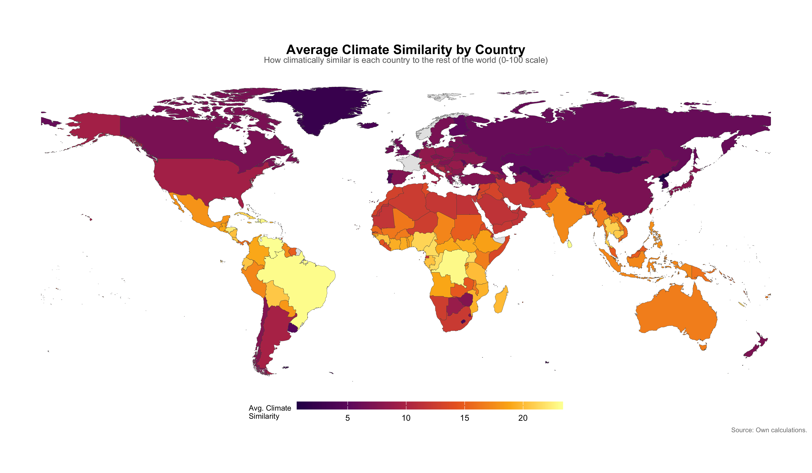
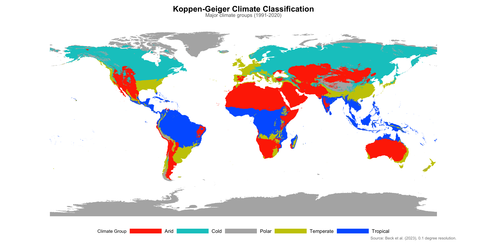
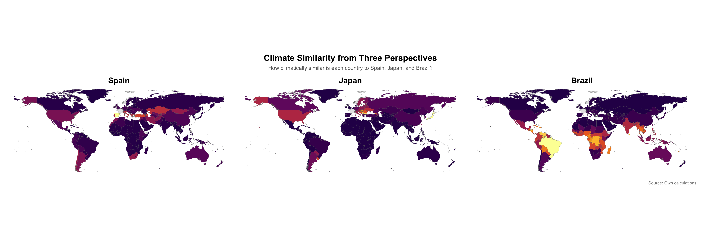

# Food Atlas: Geographic Determinants of Dietary Similarity

A geospatial analysis of how geography, climate, and socioeconomic factors shape bilateral dietary similarity between countries worldwide. Built using gravity-style econometric models with country fixed effects, applied to 10,000+ country-pair observations across two time periods (2010 and 2023).

<p align="center">
  
</p>

## Research Question

> To what extent do geographic and socioeconomic factors explain bilateral dietary similarity between countries?

While globalization drives dietary convergence, we hypothesize that geographic proximity, environmental conditions, and shared economic ties remain fundamental determinants of what people eat. We test this using a gravity-model framework — the same class of models used in international trade economics — adapted to measure dietary overlap.

## Methodology

### Dependent Variable: Bilateral Food Similarity Index

We compute a **Finger-Kreinin similarity index** (0-100 scale) for each country pair by measuring the overlap in food consumption distributions across three weighted categories:

| Category | Weight | Examples |
|----------|--------|---------|
| Meat | 30% | Bovine, poultry, fish, seafood |
| Starch | 30% | Wheat, rice, maize, potatoes |
| Vegetal products | 40% | Fruits, vegetables, oils, pulses |

Data source: [FAO Food Balance Sheets](https://www.fao.org/faostat/en/#data/FBS) (kcal/capita/day).

### Geographic Variables

All geographic variables were constructed from raw geospatial data:

- **Distance** — Log population-weighted bilateral distance between centroids
- **Climate similarity** — Finger-Kreinin overlap of [Koppen-Geiger](https://www.gloh2o.org/koppen/) climate zone distributions (0.1-degree resolution raster)
- **Elevation similarity** — Log difference in population-weighted mean elevation
- **Coastal access** — Difference in distance to nearest coastline
- **Shared borders** — Binary contiguity indicator

<p align="center">
  
</p>

### Controls

Bilateral trade intensity (BACI), GDP per capita difference (World Bank), common language, religious proximity, colonial ties, FTA/WTO membership, and social connectedness — sourced from the [CEPII Gravity dataset](http://www.cepii.fr/CEPII/en/bdd_modele/bdd_modele_item.asp?id=8).

### Estimation

**Gravity-style OLS regressions** with origin and destination country fixed effects, clustered standard errors by country-pair dyad. Six specifications per year, progressively adding controls to test robustness.

```r
# Example specification (using fixest)
feols(food_similarity ~ log_pop_dist + climate_similarity + elevation_similarity +
        shared_border + coast_diff + log_trade + common_language + religious_proximity +
        colonial_tie + fta_wto | iso_o + iso_d,
      data = df, cluster = ~dyad_id)
```

## Key Findings

**Geography dominates.** Distance, climate similarity, and elevation remain the most robust predictors of dietary similarity across all specifications and both time periods.

| Variable | Without FE | With FE | Interpretation |
|----------|-----------|---------|----------------|
| Log distance | -1.03*** | -1.27*** | Doubling distance reduces similarity by ~1 point |
| Climate similarity | +0.031*** | +0.055*** | Stronger with FE — pure geographic channel |
| Elevation similarity | +0.27* | +0.24*** | Robust across specifications |
| Bilateral trade | +0.16*** | -0.01 (n.s.) | Endogenous — absorbed by country FE |
| FTA/WTO membership | +2.4*** | +1.5*** | Institutional channel remains significant |

Trade intensity loses significance once country fixed effects are included, suggesting that the trade-diet relationship is driven by country-level characteristics rather than bilateral trade flows per se.

<p align="center">
  
</p>

## Repository Structure

```
.
├── Code/
│   ├── Cleaning Code.R              # FAO data cleaning & food similarity index
│   ├── climate_similarity.R         # Koppen-Geiger climate similarity computation
│   ├── elevation_calculation.R      # Population-weighted elevation processing
│   ├── final_project_tw.R           # Data merging, gravity variables & regressions
│   ├── climate_maps.R               # Static map visualizations (ggplot2)
│   ├── climate_maps_interactive.R   # Interactive Leaflet maps
│   ├── final_paper.Rmd              # Full reproducible pipeline (R Markdown → PDF)
│   └── *.Rmd                        # Additional analysis notebooks
├── Data/
│   ├── Raw/                         # Source data (large files not tracked — see below)
│   └── Processed/                   # Cleaned & merged datasets
├── Maps/
│   ├── Static/                      # Publication-ready PNG maps
│   └── Interactive/                 # Leaflet HTML maps
├── Notes/                           # Project documentation & reference
└── final_paper.pdf                  # Compiled research paper
```

## Technical Stack

- **Language:** R
- **Geospatial:** `terra`, `sf`, `exactextractr`, `elevatr`, `rnaturalearth`
- **Econometrics:** `fixest` (fast fixed-effects estimation)
- **Visualization:** `ggplot2`, `leaflet`, `viridis`, `patchwork`
- **Data processing:** `tidyverse`, `data.table`, `arrow`, `fuzzyjoin`
- **Output:** R Markdown (PDF), interactive HTML maps

## Data Sources

| Dataset | Source | Access |
|---------|--------|--------|
| Food Balance Sheets | [FAO FAOSTAT](https://www.fao.org/faostat/en/#data/FBS) | Public download |
| Koppen-Geiger Climate (1991-2020) | [Beck et al. (2023)](https://www.gloh2o.org/koppen/) | Public download |
| CEPII Gravity v2022 | [CEPII](http://www.cepii.fr/CEPII/en/bdd_modele/bdd_modele_item.asp?id=8) | Public download |
| BACI Trade Data HS22 | [CEPII](http://www.cepii.fr/CEPII/en/bdd_modele/bdd_modele_item.asp?id=37) | Public download |
| GDP per capita (PPP) | [World Bank](https://data.worldbank.org/indicator/NY.GDP.PCAP.PP.CD) | Public download |
| Population grid | [WorldPop](https://www.worldpop.org/) | Public download |

Large raw data files (FAO Food Balance Sheets ~604 MB, Koppen raster ~88 MB) are excluded from the repository. Download them from the links above and place in `Data/Raw/` to reproduce the full pipeline.

## Reproducing the Analysis

1. Install R dependencies: `terra`, `sf`, `exactextractr`, `elevatr`, `fixest`, `tidyverse`, `data.table`, `rnaturalearth`, `rnaturalearthdata`, `leaflet`, `viridis`, `patchwork`
2. Ensure system libraries are installed: `brew install gdal proj udunits` (macOS)
3. Download raw data files from the sources above into `Data/Raw/`
4. Run the pipeline in order:
   - `Code/Cleaning Code.R` — food similarity index
   - `Code/climate_similarity.R` — climate similarity
   - `Code/elevation_calculation.R` — elevation data
   - `Code/final_project_tw.R` — merge all variables and run regressions
5. Or knit `Code/final_paper.Rmd` for the complete reproducible document

## Team

Built as a final project for Geospatial Data Science (Prof. Bruno Conte) at Barcelona School of Economics, Spring 2026.

- **Anabel Pichardo** — Climate similarity computation, geospatial visualization, interactive maps
- **Tianqin Wang** — Data merging pipeline, gravity variable construction, regression analysis
- **Megan Yeo** — FAO data cleaning, food similarity index, elevation computation
- **Lisbeth Nordmeyer** — Regression specifications, results interpretation, write-up

## License

This project is shared for educational and portfolio purposes. All data sources are publicly available.
